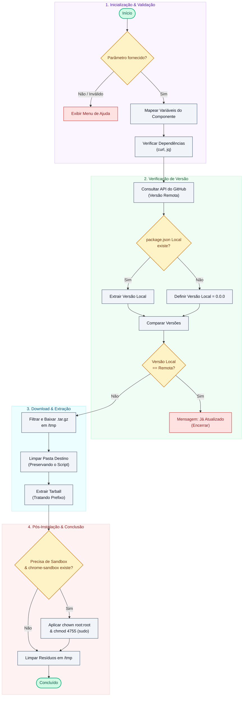

# Análise de Viabilidade Técnica: Pipeline Local de Atualização (Antigravity)

Esta análise avalia a viabilidade técnica e propõe o design da solução para automatizar as atualizações do ecossistema **Antigravity** (IDE, 2.0, CLI e SDK) em ambientes Linux (Ubuntu/Debian).

## 1. Viabilidade Técnica

A implementação de uma CLI local de atualização em Bash é **totalmente viável** e altamente recomendada pelas seguintes razões:

* **Resolução do Erro SUID Sandbox**: A automação pós-instalação garante que o binário `chrome-sandbox` (se presente) receba as permissões corretas (`root:root`, `4755`) imediatamente após a extração.
* **Economia de Recursos**: Ao consultar o endpoint `/releases/latest` da API do GitHub e comparar a tag com a versão no `package.json` local usando `jq`, evitamos downloads desnecessários de arquivos.
* **Ausência de Dependências Complexas**: O script dependerá apenas de utilitários nativos do Linux (`curl`, `jq`, `tar`, `gzip`), que são facilmente instaláveis e leves.

---

## 2. Arquitetura da Solução Proposta

O diagrama de fluxo abaixo resume o comportamento do script:

---

## 3. Estrutura de Variáveis por Componente

| Parâmetro | Nome do Repositório | Pasta de Destino | Nome do Executável | Correção de Sandbox |
| :--- | :--- | :--- | :--- | :--- |
| `ide` | `antigravity-ide` | `~/antigravity-ide` | `antigravity-ide` | **Sim** |
| `2.0` | `antigravity-2.0` | `~/antigravity-2.0` | `antigravity-2.0` | **Sim** |
| `cli` | `antigravity-cli` | `~/antigravity-cli` | `antigravity-cli` | Não |
| `sdk` | `antigravity-sdk` | `~/antigravity-sdk` | (Biblioteca/Nenhum) | Não |

---

## 4. Estratégias de Mitigação de Falhas (Resiliência)

1. **Robustez na Extração (`--strip-components`)**: O script inspecionará o conteúdo do `.tar.gz` para identificar se há um diretório raiz único antes de aplicar a flag `--strip-components=1`.
2. **Preservação de Scripts Locais**: A limpeza do diretório de destino usará a verificação `-samefile` do `find` para não excluir o próprio script caso o usuário o execute de dentro da pasta de destino.
3. **Autenticação com GitHub Token**: Caso os repositórios sejam privados ou o limite de requisições da API pública do GitHub seja atingido, o script suportará a variável de ambiente `GITHUB_TOKEN`.
4. **Erros de Rede e Timeout**: Uso de flags de segurança no `curl` (`-f`, `-L`, `--retry`) para falhar imediatamente em caso de conexões instáveis ou erros 4xx/5xx HTTP.

---

> [!NOTE]
> O script será gerado com o modo estrito do Bash (`set -euo pipefail`) para garantir que qualquer erro durante a execução aborte o processo imediatamente, prevenindo a corrupção de instalações.

> [!IMPORTANT]
> A execução pós-instalação da correção do SUID Sandbox exigirá privilégios de superusuário (`sudo`). O script solicitará a senha de forma transparente durante essa etapa.
