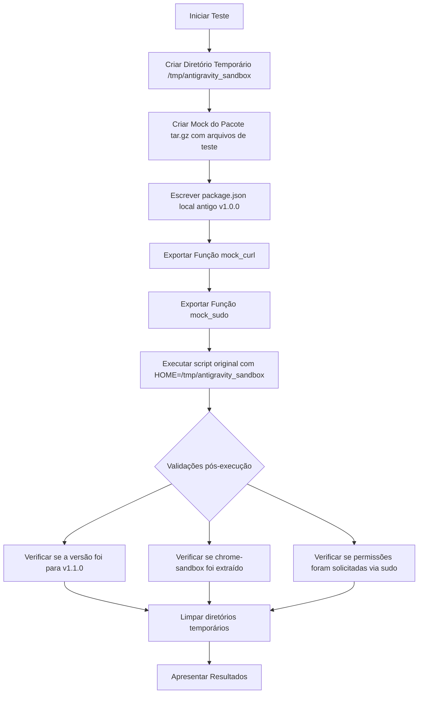

# Análise de Viabilidade: Ambiente de Testes (Sandbox)

Esta análise avalia a viabilidade de testar o script de atualização `atualizar_antigravity.sh` de forma segura e automatizada localmente.

## 1. Viabilidade dos Testes

O teste automatizado em ambiente Sandbox é **100% viável e seguro**, sem necessidade de conexão com a internet ou privilégios administrativos (`root`). Conseguimos isolar o script utilizando as seguintes técnicas:

1.  **Isolamento de Diretório (`HOME` redirecionado)**:
    *   Podemos redefinir a variável `HOME` apenas para o processo do script (ex: `HOME=/tmp/antigravity_sandbox`). Isso garante que o script leia e instale os arquivos do ecossistema no diretório temporário, sem risco de corromper dados reais do usuário.
2.  **Isolamento de Rede (Mocks de `curl`)**:
    *   Exportamos uma função `curl` personalizada usando `export -f curl`. Quando o script invocar o `curl`, ele usará a nossa função que simula respostas da API do GitHub e serve arquivos compactados locais, eliminando a dependência da rede e do rate limit da API.
3.  **Isolamento de Privilégios (Mocks de `sudo`)**:
    *   Exportamos uma função `sudo` personalizada usando `export -f sudo`. Isso evita que a execução do script trave solicitando senha ao usuário para comandos como `chown` ou `chmod` no arquivo `chrome-sandbox`.

---

## 2. Design do Fluxo de Teste (Sandbox)

O script de teste (`test_sandbox.sh`) executará o seguinte fluxo:

---

## 3. Benefícios do Teste
*   **Segurança**: Sem risco de sobrescrever arquivos de produção da sua máquina local.
*   **Velocidade**: Execução instantânea (menos de 1 segundo), pois não há download real de pacotes da web.
*   **Reprodutibilidade**: Pode ser rodado no GitHub Actions futuramente para validar novas alterações no script.
